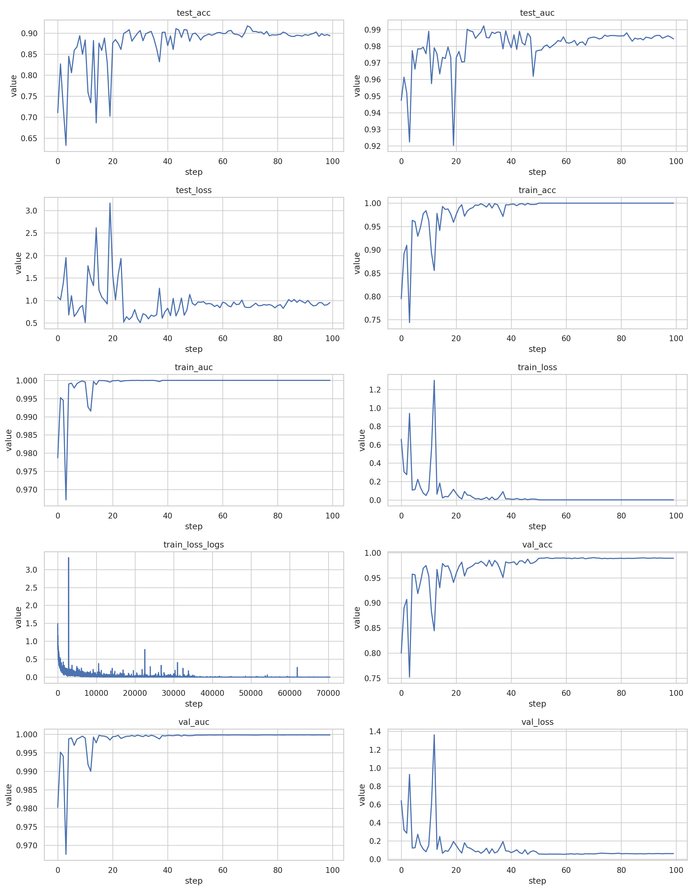
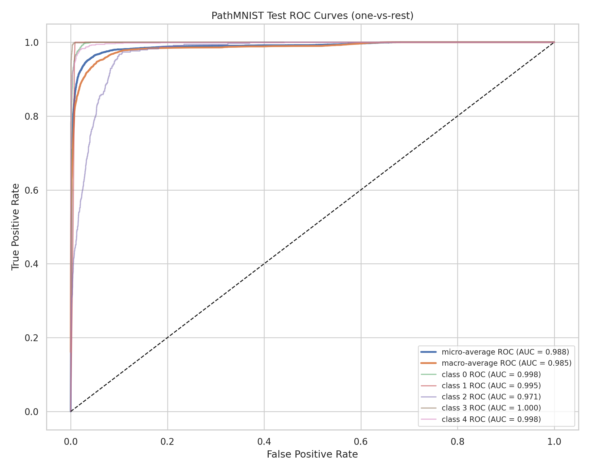
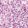

# BIOE245 Homework Responses (PathMNIST)

Run used for this report:
- Training output: /scratch/hw/pathmnist/260323_091229
- Dataset file: /data/pathmnist/pathmnist.npz

## Task 1: Run Training

Training was executed and produced a completed run at /scratch/hw/pathmnist/260323_091229.

The script configuration corresponds to train_and_eval.sh defaults with:
- dataset_root = /data/pathmnist
- output_root = /scratch/hw
- gpu_ids = 0
- model = resnet18
- data_flag = pathmnist
- num_epochs = 100 (default)
- batch_size = 128 (default)
- image size = 28 (default)

Final saved-model metrics from the output filenames/log:
- Train: AUC = 1.000, ACC = 1.000
- Val: AUC = 1.000, ACC = 0.989
- Test: AUC = 0.985, ACC = 0.895

## Task 2: Training Configuration Analysis

### 1) What learning rates are used in the training?

Initial learning rate is 0.001 (Adam).

The scheduler is MultiStepLR with gamma = 0.1 and milestones at 50% and 75% of 100 epochs:
- Epochs 0-49: 0.001
- Epochs 50-74: 0.0001
- Epochs 75-99: 0.00001

### 2) What is the train/val/test split of the dataset (sample counts)?

From /data/pathmnist/pathmnist.npz:
- Train: 89,996 samples
- Val: 10,004 samples
- Test: 7,180 samples
- Total: 107,180 samples

Approximate percentages:
- Train: 83.97%
- Val: 9.33%
- Test: 6.70%

### 3) What are the dimensions of the model input per batch?

PathMNIST image size is 28x28 with 3 channels.

After transform (ToTensor), each sample is channel-first:
- Single sample: (3, 28, 28)

With batch size 128:
- Typical batch input tensor: (128, 3, 28, 28)

Note: the final batch in a split can be smaller than 128.

### 4) What is the dimension of the model output during training? What does it represent?

The model predicts 9 classes for PathMNIST.

All 9 PathMNIST classes are:
- 0 adipose
- 1 background
- 2 debris
- 3 lymphocytes
- 4 mucus
- 5 smooth muscle
- 6 normal colon mucosa
- 7 cancer-associated stroma
- 8 colorectal adenocarcinoma epithelium

Output tensor shape:
- Typical batch output: (128, 9)

Each row is the 9-class logits for one image (before softmax in training loss calculation).

### 5) What type of task is this? What loss function is used?

Task type is multi-class, single-label classification.

Loss function used is CrossEntropyLoss.

### 6) How many files are generated after training? Where are they located and what do they contain?

Under /scratch/hw/pathmnist/260323_091229 there are 5 files plus 1 TensorBoard event file in a subfolder (6 total files):

1. best_model.pth
- Best model checkpoint state_dict.

2. pathmnist_log.txt
- Final text summary with train/val/test AUC and ACC.

3. pathmnist_train_[AUC]1.000_[ACC]1.000@model1.csv
- Per-sample train predictions/scores used by evaluator.

4. pathmnist_val_[AUC]1.000_[ACC]0.989@model1.csv
- Per-sample validation predictions/scores.

5. pathmnist_test_[AUC]0.985_[ACC]0.895@model1.csv
- Per-sample test predictions/scores.

6. Tensorboard_Results/events.out.tfevents.1774282350.dillon
- Scalar logs for losses/metrics over training.

## Task 3: Training Statistics Visualization

### 1) Where are the training statistics stored? Demonstrate how to visualize them.

Stored at:
- /scratch/hw/pathmnist/260323_091229/Tensorboard_Results/events.out.tfevents.1774282350.dillon

To visualize with TensorBoard:

tensorboard --logdir /scratch/hw/pathmnist/260323_091229/Tensorboard_Results --port 6006

Then open:
- http://localhost:6006

Screenshot of extracted curves:

### 2) How many curves are displayed? What do they represent and how are they calculated?

There are 10 scalar curves:
- train_loss_logs: per-iteration batch training loss from the training loop.
- train_loss, val_loss, test_loss: epoch-level average loss over each split.
- train_auc, val_auc, test_auc: split AUC from MedMNIST evaluator.
- train_acc, val_acc, test_acc: split accuracy from MedMNIST evaluator.

How they are computed:
- For each epoch, model is evaluated on train/val/test loaders using the test function.
- For multi-class mode, softmax scores are produced and passed to evaluator.
- Evaluator returns AUC and ACC for each split.

### 3) How does the learning rate schedule correlate with curve behavior?

The LR drops at epochs 50 and 75 by a factor of 10 each time.

Observed behavior:
- Before epoch 50: fast improvement, larger fluctuations.
- After epoch 50: curves improve more slowly and become smoother.
- After epoch 75: very small updates, mostly plateau/finetuning behavior.

This is consistent with step-decay LR schedules: large early steps for rapid learning, smaller later steps for stabilization.

### 4) Observations about curve trends (monotonic/decreasing/fluctuating)

The curves are not strictly monotonic.

Observed trend summary:
- train_loss generally decreases strongly overall, but with small fluctuations.
- val_loss and test_loss decrease early, then fluctuate and can rise later.
- AUC/ACC generally increase early and then oscillate around high values.

Reason:
- Stochastic mini-batch training causes noise.
- Validation/test metrics vary due to generalization dynamics across epochs.
- LR step changes alter optimization dynamics and often create visible slope changes.

## Task 4: AUC Metric Analysis

### 1) Is AUC used in this training script? Binary only, or adapted for multi-class?

Yes, AUC is used.

It is adapted for multi-class classification in MedMNIST evaluator by one-vs-rest averaging across classes (macro-style mean of per-class ROC AUCs), not only binary single-ROC usage.

### 2) What curve does AUC refer to? Plot this curve for the saved test model.

AUC refers to the area under the ROC curve (True Positive Rate vs False Positive Rate).

For multi-class tasks, ROC/AUC is computed one-vs-rest per class and averaged.

Plotted test ROC curves (micro/macro and selected classes):

Computed from saved model predictions on test split:
- Micro-average ROC AUC: 0.988
- Macro-average ROC AUC: 0.985

### 3) Five classes: one correct and one incorrect test example each (10 images total)

Chosen classes:
- 0 adipose
- 2 debris
- 3 lymphocytes
- 4 mucus
- 5 smooth muscle

Note: PathMNIST has 9 classes total; 5 classes are shown here because the prompt asks for "5 classes of your choice."

Class 0 (adipose)

Correct example (idx 7):

Incorrect example (idx 486):

Class 2 (debris)

Correct example (idx 20):

Incorrect example (idx 17):

Class 3 (lymphocytes)

Correct example (idx 37):

Incorrect example (idx 640):

Class 4 (mucus)

Correct example (idx 1):

Incorrect example (idx 38):

Class 5 (smooth muscle)

Correct example (idx 19):

Incorrect example (idx 15):

## Task 5: Bonus Challenge (DermaMNIST)

No architecture rewrite is required because the script is dataset-agnostic through data_flag and MedMNIST metadata.

To adapt from PathMNIST to DermaMNIST, run with:
- --data_flag dermamnist

Example command:

python ./train_and_eval.py --download --output_root /scratch/hw --gpu_ids 0 --dataset_root /data/dermamnist --data_flag dermamnist

Notes:
- Keep model_flag as resnet18 unless you want a larger backbone.
- Keep size 28 unless explicitly testing larger resized inputs.
- Outputs will be written under /scratch/hw/dermamnist/<timestamp>/.
